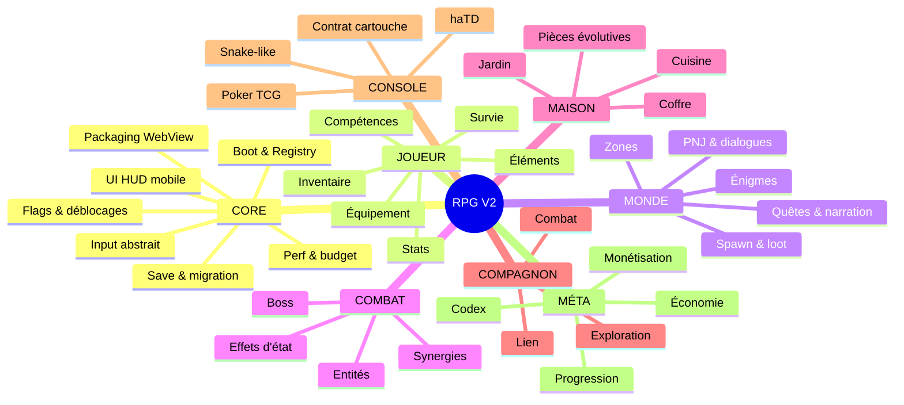
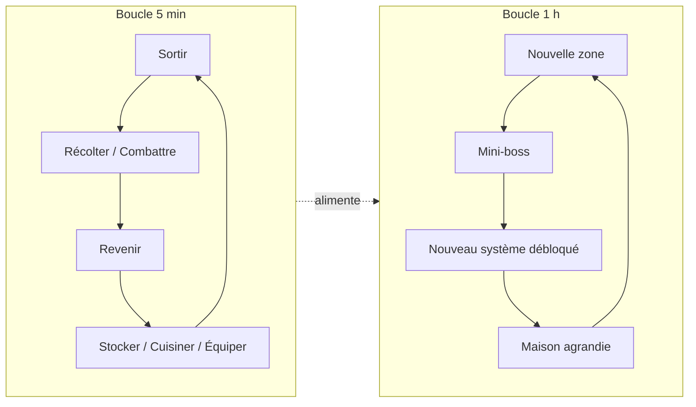
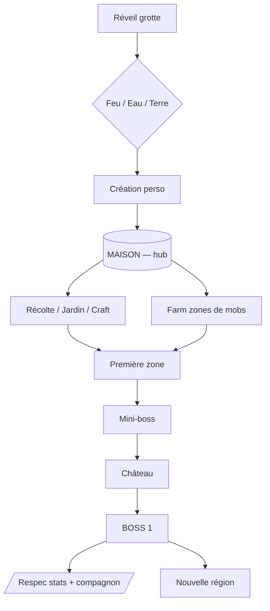

# Carte mentale — RPG V2

**Version : 1.5.0** — **cadrage clos. Roadmap rédigée : `specs/00_ROADMAP.md`. Phases 0, 1, 1b, 2 et 3 livrées et validées, chantier Construction (`05_construction-stations.md`) clos le 2026-09-19. Chantier courant : polish post-Construction, ordre détaillé dans `specs/00_ROADMAP.md`.**

**Changelog depuis 1.4.0 (2026-09-19)** : session de tri/documentation (`NS_decisions-playtest_2026-09-19.md`), aucun code touché. Construction close (validée par Xav manette + clavier, §8). **Vocabulaire de la Région Maison figé** (§3bis) : Forêt / Jardin / Zone sûre / Champs / Campagne — sert de référence à toutes les specs suivantes. Décisions du playtest du 19/09 consignées en §8 : héros à l'échelle 0,88 (visuel + hitbox), pas de roulement (règle : aucun effet ne dépend de la forme du héros), HUD sur une ligne pleine largeur (XP retirée du HUD, conservée dans Stats), follets visibles pendant le texte d'intro. **Intrusion nocturne du Chaos dans la Région Maison** actée en cadre général (§5, point ⑦ partiellement tranché) — *révise* le ton « aucun monstre » de `03_maison-exterieur.md` §5, spec à écrire : `07_chaos-nocturne.md`. Nouveaux points `[OUVERT]` : construction en zone Champs (contredit la grille intérieure), barre d'action du bas (à écrire par Xav), second rayon sûr autour de la sortie de la Grotte (proposé par Claude, retenu par défaut dans 07, à confirmer).

**Changelog depuis 1.3.0 (2026-09-17)** : session de tri/documentation (`NS_cloture-phase2_2026-09-17.md`), aucun code touché. Phase 2 close absorbée. Décisions de validation du 16-17/09 consignées en §8 (arbre fruitier increvable, indice de commande au premier déclenchement, stations solides à l'échelle ×2,1, durées et contraste du cycle jour/nuit). Référence Throne and Liberty rattachée à D20 (Maison & pièces) en §9, avec son pourquoi. Idée de mobs nocturnes dans la Région Maison inscrite en §5 comme point non tranché (⑦), sans être décidée — contredit explicitement le ton « aucun monstre » de `03_maison-exterieur.md` §5.

**Changelog depuis 1.2.0 (2026-09-16)** : décisions issues de la validation de la Phase 1 et de la dictée de la Phase 2. Grotte confirmée sans simplification (3 leviers, milieu → gauche → droite). **Phase 2 scindée** : première marche de la région (carte, ressources bloquées, items au sol, maison-structure, jour/nuit, audio) d'abord ; récolte réelle après les outils de la Phase 3 ; champs/animaux/déco plantable en spec ultérieure. Topologie de la région précisée (§3bis). Placement de la forêt par densité déterministe sur fond de layout manuel (D15①, précisé). Nouveau fil de design transversal **Crypte X** (D14⑥) : casse-tête réparti sur tout le monde, à concevoir après le Poste avancé. Report des décisions Phase 1 laissées en suspens dans `02_grotte.md` §10 (portée = arme D3②, respawn dans la grotte, survie = modulateur D19①) et synergies actées (D6③ → 🟢). Croix directionnelle réservée aux actions secondaires (C3③).

**Changelog depuis 1.1.0** : contenu des cinq scènes de M1 dicté par Xav et consigné en §3bis. Décisions de contenu qui en découlent : Grotte = donjon-tutoriel ; Maison et 1ère zone = deux régions ≥ V1_M1 (5400 × 3700) ; Château = intérieur multi-salles ; M1 se clôt sur un **Poste avancé** (hub) après Boss 1 ; stations à placement libre dans la Maison (D20③) ; XP gagnée aussi par le craft (D21) ; accès à la 1ère zone gaté par niveau ~5 ; follet à double action + source de lumière (D11). Changement d'échelle assumé : M1 ≈ 4 à 5 × le contenu V1.

**Changelog depuis 1.0.0 — révision de cadrage demandée par Xav** : la plateforme primaire devient **PC à la manette**, mobile mené en parallèle (révise C1/C3/C7/C9). Le modèle économique passe de payant-une-fois à **gratuit + dons** (révise P1). Le budget de performance se scinde en deux cibles (révise C11①). Trois risques de §0bis sont résolus ou reformulés par ces révisions.

> **Format** : Markdown + Mermaid, un seul fichier. Lisible en brut, rendu par Obsidian / VS Code / GitHub, versionnable, patchable par Claude Code.

---

## Légende des statuts

| Statut | Sens |
|---|---|
| 🟢 **VERROUILLÉ** | Décision prise, ne se rouvre pas sans raison nouvelle. Prêt pour le cahier des charges. |
| 🟡 **EN COURS** | Réponse partielle, reste un arbitrage. |
| ⚪ **NON TRAITÉ** | Pas encore abordé. **Bloque la rédaction du cahier des charges.** |
| 🔵 **HORS SCOPE V2.0** | Anticipé dans l'architecture, pas implémenté dans le vertical slice. |

**Règle de fer** : aucun cahier des charges tant qu'il reste un ⚪ en Core ou en Data-driven. — **Levée le 2026-09-15.**

**Avancement : 30 🟢 / 8 🟡 / 0 ⚪ / 1 🔵**

Les 8 🟡 restants ne sont plus des modules non traités : ce sont des sous-branches de second ordre (valeurs d'équilibrage, formats de fichier précis, listes de contenu) qui se spécifient **dans** le cahier des charges, pas avant lui. Seule exception à traiter en premier : la **table des synergies élémentaires** (D6③), qui reste à écrire et conditionne D2③.

---

## 0. Socle verrouillé

| # | Décision | Valeur |
|---|---|---|
| **C0** 🟢 | Plateforme primaire | **PC à la manette d'abord, mobile mené en parallèle** (pas un portage tardif). Conséquence : la **manette est le périphérique de référence** — le tactile est l'adaptation, plus l'inverse. Révise le « mobile-first » du brouillon d'origine. |
| **C1** 🟢 | Moteur | **HTML5 / JS / Canvas.** Pas de moteur natif. Contrainte assumée : Xav ne peut pas tenir un rôle de graphiste à plein temps → l'identité visuelle doit être atteignable par du rendu procédural / pixel art léger, pas par une production d'assets massive. Positionnement revendiqué : vitrine de la génération de jeux assistés par IA. |
| **C2** 🟢 | V1 → V2 | **Refonte.** La V1 est un prototype jetable. Aucune ligne de `rpg_v0_1_0.js` n'est reprise par défaut. Ce qui se réutilise se justifie au cas par cas (patrons, pas code). |
| **C4** 🟢 | Data-driven | **JSON externes chargés au runtime**, un fichier par catalogue, validés au chargement par un schéma. Pipeline Sheet → JSON possible en amont (patron `sync_cards.js` déjà éprouvé sur haTD). |
| **C9** 🟢 | Packaging | **Wrapper WebView** (Capacitor ou équivalent) pour le Play Store. Le jeu reste jouable en navigateur. Conséquences à respecter dès la conception : pas de dépendance à `localStorage` seul, audio initialisé sur geste utilisateur, budget de rendu canvas contraint. |
| **D2** 🟢 | Éléments | **3 éléments : Feu / Eau / Terre.** Le moteur ne code jamais « 3 » en dur : la table d'éléments et la table de forces/faiblesses sont des données, extensibles sans toucher au combat. |
| **P1** 🟢 | Modèle économique | **Gratuit + dons externes. Zéro publicité, zéro achat intégré, zéro monnaie premium** (ces trois exclusions restent des certitudes non négociables). Une **V3 sur un vrai moteur de jeu pourra, elle, être payante** — la V2 HTML assume son rôle de vitrine et de terrain d'apprentissage. Aucune mécanique de frustration monétisable : ni timer, ni énergie, ni gacha. *Révise la décision « payant une fois » du 2026-09-15.* |
| **P2** 🟢 | Périmètre V2.0 | **L'ère M1, fermée à cette chaîne exacte** : Grotte-tutoriel → Région Maison → 1ère zone de monstres → Château → **Boss 1** → **Poste avancé** (clôture de M1, pont vers M2). Tout le reste est M2+. Liste close : aucun ajout sans décision datée au §8. *Précisé le 2026-09-15 : le Poste avancé ferme M1.* |
| **D5⑤** 🟢 | Barre d'actions | **5 actions simultanées** : 1 attaque + 3 compétences + 1 consommable (potion/bandage). Le nombre de slots est une donnée, pas une constante de code. |
| **D19③** 🟢 | Survie hors-ligne | **Les jauges gèlent hors session.** Aucune décroissance quand le jeu est fermé. Cohérent avec P1 : aucune mécanique de frustration monétisable, aucune punition de l'absence. |
| **D1①** 🟢 | Stats primaires | **4 stats : Force, Agilité, Vitalité, Esprit.** Liste stockée en données. Toute stat dérivée se calcule à partir de ces 4, jamais ajoutée en dur. |
| **D21①** 🟢 | Double axe de progression | **XP → stats. Jalons narratifs → capacités.** Les deux axes sont indépendants : farmer ne débloque jamais une capacité, progresser dans l'histoire ne donne jamais de stats. Un joueur bloqué peut toujours avancer sur l'autre axe. |
| **D9①** 🟢 | Recettes | **Un seul système de recettes, une seule mécanique.** Ce qui varie est en données : la **station requise** (cuisine, forge, atelier…) et la **catégorie de sortie**. Ajouter la forge en M3 = ajouter des entrées JSON, zéro code. |
| **D1⑧** 🟢 | Rôle d'Esprit | **Réserve de lancement des compétences, rien d'autre.** Esprit ne fait pas scaler les dégâts. Conséquence à trancher en D2⑦. |
| **D3①** 🟢 | Slots d'équipement | **3 slots : arme, armure, accessoire.** Nombre et noms en données — ajouter un slot en M3+ ne touche pas le système. |
| **D2⑦** 🟢 | Scaling élémentaire | **Trois sources cumulatives** — équipement, affinité du choix initial, maîtrise qui monte à l'usage — **et toutes passent par la stat Force**, qui porte les dégâts de base. L'élément détermine le *type* de dégât et les interactions (forces/faiblesses, synergies), jamais la puissance brute. Une seule voie de scaling à équilibrer. |
| **D8①** 🟢 | Loot | **Deux tables combinées** : une table par ennemi (butin thématique) + une table par zone (ressources d'ambiance). Les deux sont des données, résolues indépendamment à chaque mort. |
| **D13①** 🟢 | Orientation narrative | **Lore diffus, aucun journal de quêtes, aucun objectif explicite.** Mystère volontaire assumé : le joueur comprend par l'exploration. Voir le risque associé en §0bis. |
| **D16①** 🟢 | Journal / Codex | **Un journal existe, mais il ne contient aucune quête et aucun objectif.** Il enregistre ce que le joueur a découvert — lieux, créatures, recettes, fragments de lore — et sert de contenu attirant par lui-même (la complétion est une motivation, pas une consigne). Le joueur reste libre de son itinéraire. |
| **D6①** 🟢 | Effets d'état | **Les trois familles en M1** : buffs/débuffs, dégâts sur la durée, contrôles. **Chaque effet découle logiquement de son élément** (Feu → brûlure, Eau → ralentissement/gel, Terre → entrave) — la logique élémentaire est la règle de design, jamais une table arbitraire. Les **synergies** (effets de combinaison d'éléments) restent entièrement à écrire. |
| **C5①②** 🟢 | Sauvegarde | **Une seule sauvegarde, automatique.** Pas de slots manuels. Voir le risque associé en §0bis. |
| **C8①** 🟢 | Déblocages | **Registre central de flags, conditions exprimées en données.** Un seul endroit répond à « pourquoi ce contenu est-il verrouillé ». Un jalon narratif (D21①) se déclare en JSON, jamais en branchement dispersé. |
| **D14①** 🟢 | Énigmes | **Catalogue de types réutilisables** (levier, séquence, poids, ordre…) **+ quelques pièces uniques scriptées** réservées aux moments forts. Une énigme banale doit coûter une entrée de données ; une énigme mémorable a le droit de coûter du code. |
| **D18①** 🟢 | Économie | **Aucune monnaie abstraite. Les éclats font office de valeur d'échange** (un marchand troque contre des éclats), les ressources de craft restent distinctes. Continuité assumée avec la V1, où éclats et inventaire ont déjà été unifiés. |
| **C6③** 🟢 | Langue | **FR + EN dès la V2.0.** Aucune chaîne de texte en dur, jamais : tout passe par des fichiers de localisation, y compris le lore. Contrainte structurante pour le rendu (largeur de texte variable) et pour le pipeline de contenu. |
| **D10①** 🟢 | Jardinage | **Croissance à l'action** (nombre de pas / actions du joueur), jamais au temps réel. Strictement cohérent avec D19③ : fermer le jeu ne fait rien avancer et ne punit rien. Aucune mécanique d'attente, aucun timer — cohérent avec P1. |
| **P4②** 🟢 | Accessibilité élémentaire | **Chaque élément est identifiable sans la couleur, dès la conception.** Forme, icône ou motif portent l'information autant que la teinte. Non négociable, pas une passe de polish : un jeu dont tout le combat repose sur 3 éléments codés en couleur est injouable pour ~8 % des joueurs masculins. |
| **C10⑤** 🟢 | Chargement | **Catalogues chargés intégralement au boot** (quelques dizaines de Ko, validés d'un bloc — un échec de schéma doit apparaître au démarrage, jamais en plein combat). **Assets de zone en chargement paresseux** à l'entrée de la zone. |
| **C11①** 🟢 | Performance | **Deux budgets distincts.** Référence : **60 fps sur PC**. Plancher : **30 fps stables sur mobile**. Le budget d'entités simultanées à l'écran se cale sur le **plancher mobile**, jamais sur le confort PC. |
| **P3①** 🟢 | Hors-ligne | **Jeu entièrement jouable hors-ligne**, aucune fonctionnalité de jeu ne dépend du réseau. Sauvegarde cloud **optionnelle** uniquement — voir son coût réel en §0bis. |
| **D15①** 🟢 | Fabrication des cartes | **Assemblage de tuiles réutilisables.** Layout de chaque zone écrit à la main en JSON (level design intentionnel, indispensable aux énigmes et au gating), palette de tuiles réutilisable (coût de production compatible avec C1), décor non-collisionnant généré par-dessus de façon **déterministe à graine fixe** (patron validé en V1). Aucune génération procédurale de layout jouable. |

---

## 0bis. Risques ouverts par les décisions verrouillées

À inscrire au cahier des charges, pas à trancher maintenant.

| Risque | Origine | Conséquence à anticiper |
|---|---|---|
| **Cohérence élémentaire RPG ↔ haTD** | D2 = 3 éléments, alors que haTD en expose 9 (`feu, eau, terre, vent, foudre, âme, ombre, lave, lumière`) | Si haTD devient une cartouche de console, un joueur verra 9 éléments dans le mini-jeu et 3 dans le RPG. Le contrat de cartouche (D17) doit soit isoler totalement les deux vocabulaires, soit prévoir une table de correspondance. À trancher avec D17. |
| ~~Découvrabilité d'un jeu payant d'emblée~~ **RÉSOLU** | P1 | Résolu le 2026-09-15 par le passage à gratuit + dons : plus aucune barrière à l'essai, et surtout plus de contrat commercial implicite — livrer M1 puis M2 puis M3 ne lèse personne, alors qu'un jeu payant arrêté à M3 aurait vendu un produit inachevé. |
| **Revenu réel proche de zéro** | P1 | À assumer les yeux ouverts : les dons convertissent typiquement bien en dessous de 1 % des joueurs. Si l'objectif de la V2 est la vitrine, le portfolio et l'apprentissage, c'est cohérent. Si un revenu était attendu de ce projet, il ne viendra pas de là — il viendra, le cas échéant, de la V3 payante sur moteur natif. |
| **Sollicitation de dons et politique Play Store** | P1 + C9 | Google Play encadre strictement les paiements sortants d'une application, et un bouton de don pointant vers un paiement externe est une zone à risque pour un développeur qui n'est pas une association. Voie prudente : ne rien solliciter dans l'app, héberger les dons sur une page externe (itch.io, Ko-fi, Liberapay). **À vérifier sur la politique en vigueur avant publication** — cette règle bouge souvent. |
| ~~« Ère M1 complète » ≠ vertical slice~~ **RÉSOLU** | P2 | Résolu le 2026-09-15 : M1 est défini comme exactement Grotte → Maison → 1ère zone → Château → Boss 1. Le périmètre coïncide avec le vertical slice d'origine. Console, cartouches et Codex sont explicitement hors M1. |
| ~~Pas de plancher de performance~~ **RÉSOLU** | C11① | Résolu le 2026-09-15 : 60 fps PC en référence, 30 fps mobile en plancher, budget d'entités calé sur le plancher. Reste à chiffrer l'appareil mobile minimum retenu (C11①ter). |
| **Coût réel du cloud** | P3① + P1 | Une sauvegarde cloud implique un backend, des comptes, une politique de confidentialité et un hébergement à vie — désormais sur un jeu **gratuit**, donc sans aucun revenu pour le financer. L'argument s'est renforcé, pas affaibli. L'export/import de fichier (C5⑦) apporte l'essentiel du bénéfice pour 0 € et zéro infrastructure. À arbitrer consciemment avant de s'engager. |
| **Volume de texte doublé** | C6③ + D13① | Le bilinguisme FR/EN s'applique à tout — et D13① fait du lore diffus le principal vecteur narratif, donc le volume de texte est élevé par construction. Deux conséquences : chiffrer le volume de M1 avant d'écrire (D13⑤), et figer tôt le pipeline de localisation pour ne pas retraduire deux fois. La traduction EN d'un lore allusif n'est pas un travail mécanique. |
| **Sauvegarde unique sans filet** | C5①② + C9 | Une seule sauvegarde automatique, dans un WebView, sans cloud : une écriture interrompue, un vidage de stockage par le système Android ou une désinstallation efface toute la partie. Sur un jeu payant, un joueur qui perd 15 h de progression laisse un avis à une étoile définitif. Deux garde-fous n'ajoutent presque aucune complexité et se décident en C5⑥⑦ : écriture en **double tampon** (on n'écrase jamais la sauvegarde valide avant que la nouvelle soit complète) et **export/import manuel** d'un fichier de sauvegarde. Le modèle « une seule sauvegarde » n'est pas remis en cause. |
| ~~Aucun journal vs sessions mobiles courtes~~ **RÉSOLU** | D13① + D16① | Résolu le 2026-09-15 : le journal existe et enregistre ce qui a été découvert, sans jamais lister d'objectif. Le mystère et la liberté sont préservés, l'orientation aussi. |
| **Aucun journal vs sessions mobiles courtes (détail d'origine)** | D13① + P3 | Un joueur qui revient après trois jours n'a aucun moyen de retrouver ce qu'il faisait. Le risque est aggravé par D21① : si les capacités sont gatées par jalons narratifs et qu'aucune trace n'existe, un joueur bloqué ne peut pas se débloquer et désinstalle. Piste qui préserverait le mystère sans sacrifier l'orientation : pas de liste d'objectifs, mais un **carnet de traces** qui n'enregistre que ce que le joueur a *déjà* vu ou entendu (indices, lieux, dialogues marquants) — il ne dit jamais quoi faire, il rappelle ce qui a été découvert. À croiser avec D16 (Codex). |
| ~~5 actions sous le pouce droit vs 4 boutons ABXY~~ **REFORMULÉ** | D5⑤ + C3 + C0 | Reformulé le 2026-09-15 : avec la manette comme périphérique de référence (C0), le mapping naturel tombe juste — **A/B/X/Y = attaque + 3 compétences, gâchette = consommable**. La difficulté se déplace intégralement du côté tactile, qui devient l'adaptation contrainte : 5 actions sous un pouce restent denses sur téléphone. À traiter en C7, comme un problème d'ergonomie mobile et non plus comme un problème de conception de gameplay. |
| **Détail d'origine — 5 actions vs 4 boutons** | D5⑤ + C3 | La manette n'a que 4 boutons faciaux : A/B/X/Y absorbent attaque + 3 compétences, le consommable déborde (gâchette, croix directionnelle, ou menu radial). Et 5 cibles tactiles sous un seul pouce, c'est beaucoup pour un écran de téléphone. À trancher dans C3 (mapping) et C7 (ergonomie), pas ici. La couche d'input abstraite protège déjà le gameplay : les verbes existent indépendamment du nombre de boutons disponibles. |

---

## 1. Vue d'ensemble



---

## 2. Boucles de jeu



⚪ Les deux boucles doivent être **chiffrées** (durée réelle, gain par cycle) avant le cahier des charges.

---

## 3. Progression globale



---

## 3bis. Les scènes de M1 (dictées par Xav, 2026-09-15)

**Cadre narratif** : la V1/M1 était le Big Bang — le nuage de gaz où les molécules s'entrechoquent (Patreon / builds de haTD). Le héros de la V2 se réveille **longtemps après**.

| Scène | Structure | Ce qu'on y fait | Sortie / déblocage | Ton | Échelle |
|---|---|---|---|---|---|
| **Grotte** | Donjon-tutoriel en 2 salles | Cinématique courte non narrée (grotte-puits, roche, obscurité, un rayon de lumière). 3 feux follets animés en survol → **choix** (Feu/Eau/Terre), les deux autres partent. Salle 1 : levier qui s'allume sans effet (préfiguration), sortie latérale. Salle 2 : un monstre apparaît → tuto attaque de base + lore du follet ; puis **3 leviers sans instruction** (milieu → gauche → droite), une porte apparaît. | Sortie directe sur la Région Maison — la grotte débouche **en bordure de carte, côté forêt** (~200 px du bord), la maison est proche, le jardin de l'autre côté de la maison (*précisé 2026-09-16*) | Mystérieux, « vu et revu » assumé — **confirmé le 2026-09-16 : aucune simplification des 3 leviers** | 2 salles |
| **Région Maison — extérieur** | Grande carte de tuiles | **Livrée et validée (2026-09-17)** — `03_maison-exterieur.md` + `04_stations-proportions-collision.md` + `04_indices-commandes.md`. **Première marche (Phase 2, `03_maison-exterieur.md`)** : forêt et rochers **bloqués** (« reviens avec les bons outils »), branches/cailloux/fruit **au sol** à ramasser (2 exemplaires par ressource, respawn aléatoire en zone libre — patron V1), poche, maison traversable dont le **toit s'efface** à l'approche, placeholders intérieurs (table, coffre, atelier) et puits « pas encore », campagne. Cycle jour/nuit, le **follet est la seule lumière**. **Ensuite** (après les outils de la Phase 3) : bois à couper, pierre à miner, **champs à semer**, animaux qui réapparaissent (loups → viande, lapins…), **déco plantable** (arbres, fleurs). Pêche : reportée. | Accès à la 1ère zone gaté par **niveau ~5** (XP de récolte et de craft) | Chill, lumineux | ≥ 5400 × 3700 |
| **Maison — intérieur** | Petite scène | **Stations à placement libre** (cuisine, table de craft), coffre de base, inventaire poche → sac de craft, déco légère. Plus tard : armurerie, alchimie… (entrées JSON). Zone de camp : se ressourcer, se préparer. | — | Chill | 1 pièce |
| **1ère zone de monstres** | Région façon V1 : salles, passages | Farm de mobs, **mini-boss et boss farmables**. Synergies du follet en **double action** (boost attaque / vitesse d'attaque / vitesse de déplacement côté joueur ; ralentissement / dégâts côté monstres). | Mène au Château | Chaos, sombre | ≥ 5400 × 3700 |
| **Château** | Intérieur multi-salles | Mini-boss à tir à distance, énigmes uniques | Boss 1 | Tendu | multi-salles |
| **Boss 1** | Arène | Boss en phases, télégraphié | Débloque **respec + changement de compagnon** | — | 1 arène |
| **Poste avancé** | Équivalent de la Maison + **Hub** | Stockage, craft, et point de départ vers M2 | Clôture de M1 | — | 1 scène |

**Grande modularité (grandes pièces, agencement) : réservée au Château / Poste avancé, pas à la première Maison.**

### Vocabulaire de la Région Maison (figé le 2026-09-19, sert à toutes les specs suivantes)

| Mot | Sens |
|---|---|
| **Forêt** | Le côté de la carte où débouche la Grotte. |
| **Jardin** | Ce qui est proche de la maison : le puits, l'arbre fruitier, l'endroit où le fruit réapparaît. **Le Jardin est la zone sûre.** |
| **Zone sûre** | Maison + Jardin. Aucun monstre n'y apparaît, aucun n'y entre. |
| **Champs** | Les angles de la carte **à l'opposé de la Forêt**, hors d'un rayon extérieur autour de la maison et du Jardin. C'est là que le Chaos s'installe la nuit. |
| **Campagne** | Le reste. |

Note de lecture (Xav) : « fluidité » désigne le **ressenti des mouvements** (stick + follet en orbite), validé. La régularité de l'affichage (saccades) est un sujet distinct — voir Dette dans `CLAUDE.md`.

---

## 4. CORE — sous-branches

| # | Module | Statut | Sous-branches à traiter |
|---|---|---|---|
| C3 | **Input abstrait** | 🟡 | ① liste définitive des verbes (`MOVE ATTACK SKILL DODGE INTERACT MENU` + ?) · ② mapping tactile · ③ mapping manette ABXY · ④ mapping clavier · ⑤ remapping par le joueur ? · ⑥ détection auto du périphérique · ⑦ gestion du hot-swap manette en cours de partie |
| C5 | **Save & migration** | 🟡 | ✅② sauvegarde unique automatique · ① support de stockage (IndexedDB recommandé, jamais localStorage seul — cf. C9) · ③ versionnement du schéma + migration · ④ sauvegarde auto (quand ?) · ⑤ cloud / reprise multi-appareil · ⑥ anti-corruption (double buffer) · ⑦ export/import manuel |
| C6 | **Settings / Audio / i18n** | 🟡 | ✅③ FR + EN dès la V2.0, zéro chaîne en dur · ① options graphiques (budget perf) · ② volumes séparés · ④ format des fichiers de localisation et clés · ⑤ gestion des largeurs de texte variables à l'écran |
| C7 | **UI / HUD** | 🟡 | ⓪ **la manette est la référence, le tactile l'adaptation** (C0) · ① portrait ou paysage (ou les deux) · ② résolution de référence + scaling · ③ zones de pouce / safe areas (encoches) · ④ taille minimale des cibles tactiles · ⑤ structure des menus (inventaire, carte, journal) · ⑥ feedback haptique · ⑦ règle « zéro pop-up commercial » actée |
| C8 | **Flags & déblocages** | 🟡 | ✅① registre central, conditions en données · ② format exact d'une condition · ③ graphe de dépendances des systèmes · ④ comportement si un flag est atteint hors ordre prévu |
| C10 | **Boot & Registry** | 🟡 | ✅⑤ catalogues au boot, assets de zone en paresseux · ① ordre de chargement · ② validation de schéma : échec dur au démarrage (recommandé) · ③ résolution des références croisées · ④ rechargement à chaud en dev |
| C11 | **Perf & budget** | 🟡 | ✅① 60 fps PC (référence) + 30 fps mobile (plancher) · ①ter appareil mobile minimum à nommer · ② nombre max d'entités à l'écran · ③ stratégie de rendu (redraw complet vs dirty rects) · ④ budget mémoire · ⑤ consommation batterie |

---

## 5. DATA-DRIVEN — sous-branches (le gros du travail restant)

| # | Catalogue | Statut | Sous-branches à traiter |
|---|---|---|---|
| D1 | **Stats & formules** | 🟡 | ✅① Force / Agilité / Vitalité / Esprit · ② stats dérivées (PV, dégâts, vitesse, crit, résistances) · ③ formule de dégâts · ④ courbe de scaling par niveau · ⑤ plafonds · ⑥ respec (débloqué après Boss 1) · ⑦ où vivent les formules : code ou données · ⑧ **rôle exact d'Esprit** — dégâts élémentaires ? ressource de skill ? les deux ? (à croiser avec D5④) |
| D2 | **Éléments & synergies** | 🟡 | ✅ nombre = 3 (Feu/Eau/Terre), table extensible en données · ② table de forces/faiblesses · ③ définition d'une synergie · ④ ce que le choix initial verrouille vraiment · ⑤ correspondance avec les 9 éléments haTD (voir §0bis) · ⑥ rendu visuel d'un élément sans dépendre de la couleur seule (voir P4) · ✅⑦ scaling via équipement + affinité + maîtrise, tout converge sur Force · ⑧ comment la maîtrise élémentaire monte exactement |
| D3 | **Équipement / armes** | 🟡 | ✅① 3 slots : arme, armure, accessoire · ② schéma d'une arme (`name type damage element speed abilities requirements effects`) · ③ raretés · ④ upgrade / enchantement · ⑤ sets · ⑥ conditions de port · ⑦ apparence liée ou cosmétique séparée |
| D4 | **Inventaire & ressources** | 🟡 | ① inventaire générique unifié (acté en V1) · ② capacité / stacks · ③ coffre de la Maison vs sac porté · ④ tri & filtres · ⑤ que fait-on quand c'est plein · ⑥ catégories de ressources |
| D5 | **Compétences** | 🟡 | ✅⑤ 5 slots : 1 attaque + 3 skills + 1 consommable · ① actives vs passives · ② arbre, slots ou déblocage linéaire · ③ schéma d'une compétence · ④ ressource de lancement (mana ? cooldown ? les deux ?) · ⑥ compétences liées à l'arme ou au personnage · ⑦ le slot consommable est-il fixe ou libre |
| D6 | **Effets d'état** | 🟡 | ✅① les 3 familles, dérivées logiquement de l'élément · ② durée / stacking / refresh · ③ **table des synergies élémentaires à écrire** (bloquant pour D2③) · ④ affichage HUD avec 5 slots d'action déjà occupés · ⑤ source (repas, compétence, environnement) |
| D7 | **Ennemis & boss** | 🟡 | ① schéma d'un ennemi · ② archétypes de comportement (mêlée, tir à distance, téléport) · ③ patterns de boss en données ou en code · ④ phases · ⑤ scaling par zone · ⑥ spawn (voir D15) |
| D8 | **Loot & récompenses** | 🟡 | ✅① table par ennemi + table par zone, combinées · ② pondérations / rareté · ③ pity timer · ④ récompenses de première fois vs répétables · ⑤ sources hors combat (récolte, énigme, mini-jeu) |
| D9 | **Recettes** | 🟡 | ✅① système unique, stations et catégories en données · ② schéma d'une recette · ③ découverte (connue vs à trouver) · ④ liste des stations en M1 (cuisine seule ?) · ⑤ temps de fabrication · ⑥ buffs alimentaires = vrai système de build · ⑦ échec / qualité |
| D10 | **Jardinage** | 🟡 | ✅① croissance à l'action, jamais au temps réel · ② schéma d'une culture · ③ nombre de parcelles / extension · ④ arrosage, saisons, aléas · ⑤ lien avec la cuisine |
| D11 | **Compagnons** | 🟡 | ✅ le follet suit dès la Grotte, **double action** (joueur : attaque / vitesse d'attaque / déplacement — monstres : ralentissement / dégâts) et **seule source de lumière la nuit** · ① stats propres · ③ capacités d'exploration · ④ équipable ? · ✅⑤ changement débloqué après Boss 1 · ⑥ lien comportemental (M2+) · ⑦ alignement (M2+) |
| D12 | **PNJ & dialogues** | 🟡 | ① schéma d'un dialogue · ② branches et conditions · ③ conséquences persistantes · ④ marchands · ⑤ PNJ récurrents vs décor · ⑥ dialogue influencé par l'élément choisi |
| D13 | **Quêtes & narration** | 🟡 | ✅① lore diffus, aucun journal d'objectifs · ② comment un jalon narratif (D21①) est déclenché sans quête formelle · ③ comment un joueur revenu après une semaine se réoriente (voir §0bis) · ④ rattachement de M1 à la trame M1→M7 · ⑤ volume de texte à écrire pour M1 |
| D14 | **Énigmes / puzzles** | 🟡 | ✅① types réutilisables + pièces uniques · ② rôle du compagnon dans la résolution · ③ difficulté / indices · ④ blocage dur ou contournable · ⑤ piste « DaVinciCode » · ✅⑥ **fil « Crypte X »** (*acté 2026-09-16, gros point*) : un casse-tête **réparti sur tout le monde** — un bouton dans la Maison, un levier dans le Château, des symboles éparpillés dont un seul est à noter dans un cryptex une fois ouvert, la grotte de départ en fait partie ; **conçu comme un circuit imprimé superposé à la carte du monde, avec des portes logiques à connecter et une combinaison finale**. Dépend d'une **vision globale du monde** : **rien n'est dessiné avant le Poste avancé**. Dès la Phase 2, chaque scène réserve en données les emplacements (bouton, levier, symboles) sans poser d'objet, pour ne jamais redessiner une carte pour lui. Jeu de mots assumé : crypte X / secret eggs |
| D15 | **Zones / maps / spawn** | 🟡 | ✅① tuiles réutilisables + layout main-made + décor procédural déterministe — *précisé 2026-09-16* : sur une grande carte, le layout manuel pose chemins, clairières, structures, bords et **les pièces interactives placées une à une (un arbre interactif par-ci par-là)** ; les masses (forêt) sont remplies par **densité à graine fixe** sous ce calque manuel — même carte pour tous, illusion du fait-main pour le joueur · ② schéma d'une zone · ③ portails déclaratifs (patron V1 validé) · ④ tables de spawn par zone · ⑤ densité et repop · ⑥ conditions d'accès · ⑦ mode Chaos/Normal : repris en V2 ou abandonné |
| D16 | **Journal / Codex** | 🟡 | ✅① journal sans quêtes ni objectifs, enregistre les découvertes · ② catégories exactes (lieux, créatures, recettes, lore, compagnons) · ③ récompense de complétion ou valeur purement intrinsèque · ④ les entrées non découvertes sont-elles visibles en silhouette · ⑤ le journal est-il une pièce de la Maison ou un menu permanent |
| D17 | **Mini-jeux (cartouches)** | 🟡 | ① **contrat d'interface commun cartouche ↔ RPG** (le point critique) · ② isolation (iframe ? module ?) · ③ ce qu'une cartouche peut lire/écrire dans la sauvegarde RPG · ④ récompenses renvoyées au RPG · ⑤ acquisition des cartouches · ⑥ haTD, poker TCG, snake-like, mode balade · ⑦ ajout d'une cartouche sans toucher au RPG |
| D18 | **Économie** | 🟡 | ✅① éclats = valeur d'échange, ressources de craft distinctes · ② sources et puits d'éclats · ③ y a-t-il un marchand en M1 · ④ prix en données · ⑤ **tension à arbitrer** : les éclats servent déjà aux paliers de vitalité (V1) — dépenser chez un marchand entre alors en concurrence directe avec la survie |
| D19 | **Survie** | 🟡 | ✅③ gel total hors session · ① nature exacte des pénalités progressives · ② vitesse de décroissance en jeu · ④ mort possible par faim ? · ⑤ lien cuisine → buffs · ⑥ désactivable / mode détente |
| D20 | **Maison & pièces** | 🟡 | ✅① M1 : cuisine, table de craft, coffre · ✅③ **placement libre des stations** dans la Maison ; grande modularité réservée au Château/Poste avancé · ✅⑥ la Maison est le point d'arrivée après la Grotte (pas à débloquer) · ② stations futures (armurerie, alchimie…) · ④ coût d'amélioration · ⑤ effets mécaniques de chaque station |
| D21 | **Progression & déblocages** | 🟡 | ✅① double axe XP→stats / jalons→capacités · ✅ **sources d'XP : combat et craft** · ✅ accès 1ère zone gaté par niveau ~5 · ② courbe d'XP · ③ points de stat par niveau : attribution libre ou automatique · ④ liste des jalons de M1 · ⑥ rythme des boss |

**D19 / D10 (jardin)** — cadre général tranché le 2026-09-19, détail encore ouvert :

> ⑦ **Intrusion nocturne du Chaos dans la Région Maison — tranchée en partie le 2026-09-19** (`NS_decisions-playtest_2026-09-19.md`) : *révise* « aucun monstre, ton chill » de `03_maison-exterieur.md` §5. Motif : la carte s'est révélée bien plus grande que prévu, et la nuit au seul follet est l'ambiance la plus forte du jeu à ce stade. Cadre acté : la nuit seulement ; une zone de Chaos dans les **Champs** (vocabulaire ci-dessus) ; monstres présents jusqu'à la fin de la nuit ; quelques-uns épars en **Forêt** ; **un monstre qui entre en zone sûre (Maison + Jardin) fait demi-tour** — condition sur la position du monstre, jamais sur celle du joueur. Spec à écrire : `07_chaos-nocturne.md`. `[OUVERT]` restant : **la destruction des plantations par les monstres n'est pas tranchée** — le jardinage n'existe pas encore, donc rien à détruire pour l'instant ; à retrancher quand D10 (jardinage) sera écrit.

---

## 6. PRODUIT

| # | Module | Statut | Sous-branches |
|---|---|---|---|
| P1 | **Modèle économique** | 🟢 | ✅ gratuit + dons externes, zéro pub, zéro achat intégré · ✅ aucune mécanique de frustration monétisable · ✅ V3 sur moteur natif potentiellement payante · reste ① plateforme de don · ② conformité Play Store (§0bis) |
| P2 | **Périmètre V2.0** | 🟢 | ✅ M1 = Grotte → Maison → 1ère zone → Château → Boss 1 · ✅ console, cartouches et Codex hors M1 · reste ① durée de jeu visée (à chiffrer avec les boucles §2) |
| P3 | **Session courte / offline** | 🟡 | ✅① 100 % hors-ligne, cloud optionnel seulement · ② reprise instantanée · ✅③ aucun timer punitif (garanti par D10①/D19③/P1) · ④ le cloud est-il vraiment retenu (§0bis) |
| P4 | **Accessibilité** | 🟡 | ✅② éléments identifiables sans la couleur, dès la conception · ① taille minimale des cibles tactiles · ③ mode une main · ④ vitesse de texte / temps de lecture |
| P5 | **Store / âge / conformité** | 🔵 | Repoussé après la V2.0 |

---

## 7. Règle d'architecture directrice

> On ne spécifie pas seulement ce que le jeu doit faire aujourd'hui.
> On spécifie **comment le jeu doit pouvoir accepter ce qu'on n'a pas encore imaginé.**

Test à appliquer à chaque catalogue :

```
Ajouter une entrée (arme, ennemi, recette, cartouche, compagnon…)
  → possible en ajoutant UNE entrée JSON,
    sans toucher une seule ligne de code de système ?
  → si NON : le module n'est pas prêt pour le cahier des charges.
```

---

## 8. Journal des décisions

| Date | Module | Décision | Motif |
|---|---|---|---|
| 2026-09-15 | — | Carte mentale ouverte, format Markdown + Mermaid | Interface visuelle évolutive, éditable par Claude Code |
| 2026-09-15 | C1 | HTML5/JS/Canvas | Pas de rôle graphiste tenable ; positionnement « jeu de la génération IA » |
| 2026-09-15 | C2 | Refonte complète, V1 = prototype jetable | Permet de poser une architecture data-driven propre |
| 2026-09-15 | C4 | JSON externes + schéma de validation | Seul format qui fait passer le test « une entrée = zéro code » en HTML/JS |
| 2026-09-15 | C9 | Wrapper WebView pour le Play Store | Conséquence directe de C1 ; impose des contraintes de save/audio/perf dès la conception |
| 2026-09-15 | D2 | 3 éléments : Feu / Eau / Terre | Lisibilité pour le joueur ; table extensible en données, rien de codé en dur |
| 2026-09-15 | P1 | Payant une fois, zéro pub, zéro achat | Cohérent avec la règle « aucun pop-up commercial » ; interdit toute mécanique de frustration monétisable |
| 2026-09-15 | P2 | Périmètre V2.0 = ère M1 complète | Ambition produit assumée ; impose en contrepartie une liste de contenu fermée avant tout code |
| 2026-09-15 | P2① | M1 fermé : Grotte → Maison → 1ère zone → Château → Boss 1 | Ferme le risque de scope ; console/cartouches/Codex repoussés en M2+ |
| 2026-09-15 | D5⑤ | 5 slots d'action : 1 attaque + 3 skills + 1 consommable | Contrainte du pouce droit ; nombre de slots stocké en donnée, pas en dur |
| 2026-09-15 | D19③ | Jauges de survie gelées hors session | Aucune punition de l'absence, cohérent avec P1 |
| 2026-09-15 | D1① | 4 stats : Force, Agilité, Vitalité, Esprit | Assez pour du build, assez peu pour rester lisible sur mobile |
| 2026-09-15 | D21① | XP → stats, jalons narratifs → capacités | Deux axes indépendants : un joueur bloqué sur l'un avance toujours sur l'autre |
| 2026-09-15 | D9① | Système de recettes unique, stations en données | Ajouter forge/atelier/labo en M3+ = entrées JSON, zéro code de système |
| 2026-09-15 | D1⑧ | Esprit = réserve de skills uniquement | Ouvre D2⑦ : le scaling élémentaire doit venir d'ailleurs |
| 2026-09-15 | D3① | 3 slots : arme, armure, accessoire | Lisible sur mobile ; slots déclarés en données pour extension future |
| 2026-09-15 | D15① | Tuiles réutilisables, layout main-made, décor procédural déterministe | Seul compromis tenable entre C1 (pas de graphiste) et le level design intentionnel qu'exigent énigmes et gating |
| 2026-09-15 | D2⑦ | Équipement + affinité + maîtrise, tous convergent sur Force | Une seule voie de scaling à équilibrer ; l'élément porte le type, pas la puissance |
| 2026-09-15 | D8① | Table par ennemi + table par zone | Butin thématique et ressources d'ambiance séparés proprement |
| 2026-09-15 | D13① | Lore diffus, aucun journal de quêtes | Mystère volontaire assumé ; ouvre un risque d'orientation inscrit en §0bis |
| 2026-09-15 | D16① | Journal de découvertes, sans quêtes ni objectifs | Résout le risque d'orientation sans sacrifier le mystère ; la complétion devient un contenu attirant en soi |
| 2026-09-15 | D6① | Buffs/débuffs + DoT + contrôles, dérivés logiquement de l'élément | La logique élémentaire tient lieu de règle de design ; les synergies restent à écrire |
| 2026-09-15 | C5①② | Sauvegarde unique automatique | Simplicité ; impose en contrepartie double tampon et export manuel (§0bis) |
| 2026-09-15 | C8① | Registre central de flags, conditions en données | Seule option cohérente avec C4 ; rend les jalons narratifs déclarables sans code |
| 2026-09-15 | D14① | Types d'énigmes réutilisables + quelques pièces uniques | Le banal coûte une donnée, le mémorable a le droit de coûter du code |
| 2026-09-15 | D18① | Éclats comme valeur d'échange, pas de monnaie abstraite | Continuité V1 assumée ; ouvre une tension éclats/paliers de vitalité à arbitrer |
| 2026-09-15 | C6③ | FR + EN dès la V2.0, aucune chaîne en dur | Ouvre le marché anglophone dès la sortie ; impose un pipeline de localisation dès le premier jour |
| 2026-09-15 | D10① | Croissance des cultures à l'action, pas au temps réel | Cohérence stricte avec D19③ et P1 : aucune mécanique d'attente, aucune punition de l'absence |
| 2026-09-15 | P4② | Éléments identifiables sans la couleur | Le combat repose entièrement sur 3 éléments ; les coder par la seule couleur exclurait ~8 % des joueurs masculins |
| 2026-09-15 | C10⑤ | Catalogues au boot, assets de zone en paresseux | Un échec de validation doit apparaître au démarrage, jamais en plein combat |
| 2026-09-15 | C11① | 60 fps sur mobile récent | Cible produit ; plancher encore à définir (§0bis) |
| 2026-09-15 | P3① | 100 % hors-ligne, cloud optionnel | Aucune mécanique ne dépend du réseau ; le cloud reste à arbitrer au vu de son coût (§0bis) |
| 2026-09-15 | **C0** | **PC à la manette d'abord, mobile en parallèle** | Révise le « mobile-first » du brouillon ; la manette devient le périphérique de référence, le tactile l'adaptation |
| 2026-09-15 | **P1 (révisé)** | **Gratuit + dons ; V3 sur moteur natif potentiellement payante** | Un jeu payant arrêté à M2/M3 vendrait un produit inachevé ; le gratuit permet de livrer ère par ère sans léser personne |
| 2026-09-15 | **C11① (révisé)** | **60 fps PC en référence, 30 fps mobile en plancher** | Une cible unique masquait deux réalités techniques opposées ; le budget d'entités se cale sur le plancher |
| 2026-09-15 | Scènes M1 | Grotte-tutoriel 2 salles ; Maison et 1ère zone = deux régions ≥ V1_M1 ; Château multi-salles ; Poste avancé clôt M1 | Dicté par Xav ; échelle de M1 ≈ 4-5 × la V1, à découper en phases livrables (cf. ROADMAP) |
| 2026-09-15 | D20③ | Stations à placement libre dans la Maison | Première maison légère ; la vraie modularité attend le Château/Poste avancé |
| 2026-09-15 | D21 | XP par combat **et** par craft ; 1ère zone gatée par niveau ~5 | La boucle de camp doit suffire à préparer le premier combat sérieux |
| 2026-09-15 | D11 | Follet à double action + seule source de lumière | Donne au choix initial une valeur tactique et d'exploration dès la nuit tombée |
| 2026-09-15 | D6③ → 🟢 | Table des synergies actée : Feu = Force +1 / brûlure ; Eau = Agilité +1 / affaiblissement ; Terre = Vitalité +1 / entrave (cf. `02_grotte.md` §3.4) | Les trois familles de D6① représentées ; débloque D2③. Valeurs provisoires en données |
| 2026-09-15 | D3② | Portée = équipement : chaque arme porte `portee {min, max}` en tuiles, aucune stat ne la modifie | Un arc = une entrée JSON sans code ; la portée est un choix de build, pas une progression |
| 2026-09-15 | Mort | Respawn dans la grotte pour tout le jeu, PV pleins, malus faim/soif (Phase 3) | La punition est le trajet et le malus, jamais la perte de progression |
| 2026-09-15 | D19① | Survie = modulateur de stats (×(0,5 + 0,5 × jauge)), jamais une mort | Cohérent avec « pénalités progressives, jamais bloquantes » ; plancher 50 % en données |
| 2026-09-15 | C3③ | Croix directionnelle réservée aux actions secondaires, n'alimente jamais `MOVE` | Libère un périphérique pour de futures actions sans conflit avec le stick |
| 2026-09-16 | Grotte | 3 leviers sans instruction confirmés, aucune simplification pour joueurs occasionnels | Première pierre du fil Crypte X ; la difficulté d'entrée est assumée |
| 2026-09-16 | D14⑥ | **Fil Crypte X** : casse-tête réparti sur tout le monde, circuit imprimé + portes logiques + combinaison, conçu après le Poste avancé | Exige une vision globale du monde ; chaque scène réserve ses emplacements en données dès maintenant |
| 2026-09-16 | Phase 2 | Scindée : première marche (carte, ressources bloquées, items au sol, maison-structure, jour/nuit, audio) → récolte réelle après les outils (Phase 3) → champs/animaux/déco en spec ultérieure | La récolte sans outil n'a pas de sens ; livrer une région traversable d'abord garde chaque palier jouable |
| 2026-09-16 | §3bis | Topologie : grotte en bordure côté forêt (~200 px), maison proche, jardin de l'autre côté de la maison, campagne ensuite | Dicté par Xav comme parcours de première marche |
| 2026-09-16 | D15① | Forêt par densité à graine fixe sous un layout manuel ; pièces interactives placées une à une | L'illusion du fait-main suffit au joueur ; ~2 000 arbres à la main n'est pas tenable |
| 2026-09-16 | C4 | Layout des grandes scènes encodé en lignes de caractères + légende | Le JSON tableau-de-tableaux devient inéditable à 168 × 115 tuiles |
| 2026-09-16 | Maison | Toit effacé par proximité, rayon = halo du follet × 1,25 (provisoire, à équilibrer au ressenti) ; placeholders intérieurs et puits à leur position définitive | La maison n'est jamais redessinée quand la Phase 3 branche les vraies stations |
| 2026-09-16 | Ressources | Catalogue ouvert : 2 au départ (bois, pierre), beaucoup à venir, une ressource = une entrée JSON | Test data-driven exigé à la livraison |
| 2026-09-16 | Audio | Bande son piano solo (en production) = premier son du jeu ; init sur geste utilisateur en Phase 2 | Contrainte WebView déjà active depuis C9 |
| 2026-09-16 | Ressources | **L'arbre fruitier ne se coupe jamais** : fruits, puis jardin/récolte/craft/cuisine | Le fruitier est une source renouvelable, pas un stock de bois ; garde un repère fixe dans le jardin |
| 2026-09-16 | UI | **Indice de commande au premier déclenchement de chaque verbe seulement**, glyphe du périphérique actif, jamais répété | Compromis « ne pas guider / montrer chaque touche une fois » ; data-driven par verbe (`04_indices-commandes.md`) |
| 2026-09-16 → 17 | D20 | **Stations solides**, échelle ×2,1, empreinte = boîte englobante du visuel, seuil d'interaction au bord — *révise* « placeholders non solides » | La table était plus petite que le héros ; la collision ne gênait pas, les proportions si |
| 2026-09-17 | Jour/nuit | Durées par phase indépendantes (jour 10 min, aube/crépuscule 1 min 30, nuit 4 min) ; nuit extérieure 0,85 > plafond grotte 0,72 | Contraste jugé trop faible en jeu ; ordre de grandeur, non figé |
| 2026-09-16 | Phase 2 | **Close** : carte, ressources bloquées, items au sol, maison-structure, jour/nuit, audio validés ; taille de carte validée ; jouabilité > V1 | Verdict Xav manette/clavier ; tactile en dette jusqu'à un lien de partage (Phase 4+) |
| 2026-09-19 | Construction | **Close** : validée par Xav en jeu à la manette puis au clavier seul, après le correctif de parité clic/verbe | Clôt le chantier `05_construction-stations.md` ; captures d'écran (checklist visuelle) restent dues |
| 2026-09-19 | Héros | Échelle **0,88** (visuel et hitbox dérivés d'une seule échelle), pas de roulement — règle : aucun effet ne dépend de la forme du héros (reste un visuel remplaçable), effet de déplacement = traînée de poussière | Cohérence visuelle après retour Xav en jeu ; le héros doit rester substituable sans casser d'effet dépendant de sa forme |
| 2026-09-19 | UI | HUD sur une ligne en haut, pleine largeur ; barre d'XP retirée du HUD (niveau seul affiché), conservée dans l'écran Stats | Simplification demandée par Xav après ressenti en jeu |
| 2026-09-19 | Intro | Les follets non élus restent visibles pendant le texte de l'intro (au lieu de disparaître avant) | Retour Xav, cohérence de la scène |
| 2026-09-19 | D10/D19 (⑦) | **Intrusion nocturne du Chaos dans la Région Maison** — *révise* « aucun monstre, ton chill » de `03_maison-exterieur.md` §5 ; cadre : nuit seulement, zone de Chaos dans les Champs, quelques monstres épars en Forêt, demi-tour à l'entrée en zone sûre (Maison+Jardin) | Carte bien plus grande que prévu ; la nuit au seul follet est l'ambiance la plus forte du jeu à ce stade — spec à écrire, `07_chaos-nocturne.md` |

---

## 9. Références d'inspiration (à répartir par module)

Guild Wars · Stormfall: Saga of Survival · GrimSoul · Orna · Pokémon Jaune · Zelda Oracle of Seasons/Ages · Final Fantasy IX · Fable · Throne and Liberty · Don't Starve · Green Hell · Le Seigneur des Anneaux · Harry Potter · Wakfu · Avatar: The Last Airbender · Magic The Gathering · Deuce-to-Seven Triple Draw · Golden Sun · Little Alchemy 2 · Spore · Portal 1 & 2 · Black & White 2 · Minecraft

> Chaque référence sera rattachée à un module **avec son « pourquoi »** — quelle mécanique précise on emprunte, pour résoudre quel problème de design.

**Throne and Liberty → D20 (Maison & pièces)** : housing cité par Xav comme référence de « ce que d'autres jeux font mieux » sur l'envie de construire et de revenir. Ce qu'on emprunte : à préciser à la spec Phase 3 (placement libre, lisibilité de la pièce) — pas la modularité lourde, réservée au Château/Poste avancé (D20③).
